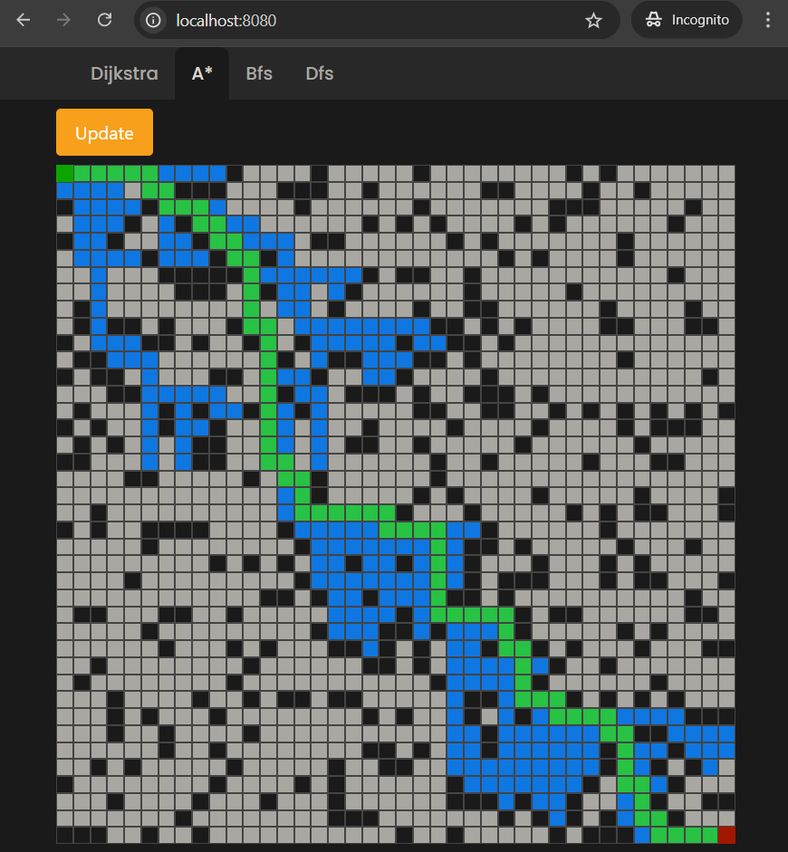
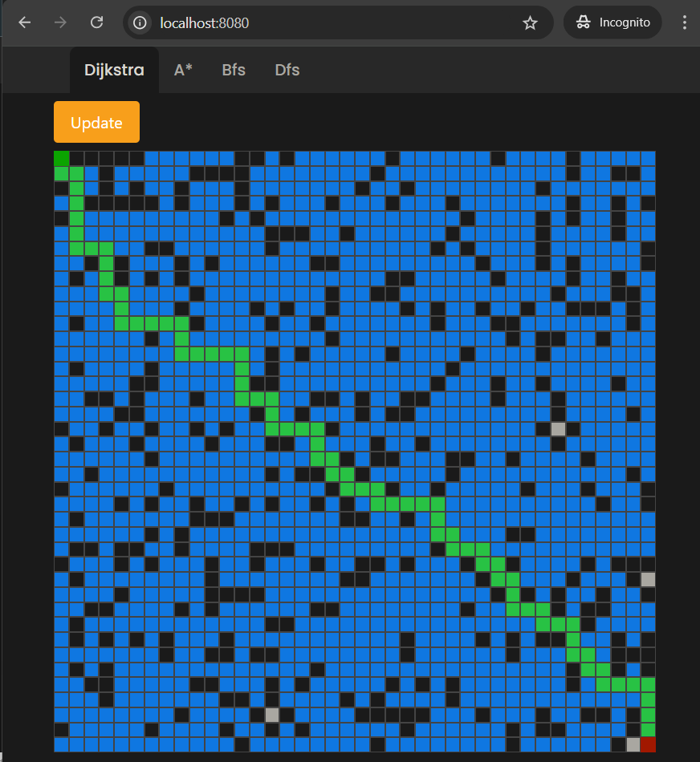

# Algorithm Visualizer

Algorithm Visualizer is a web application built with Spring Boot and Thymeleaf that visualizes various pathfinding algorithms. This tool is designed to help users understand how algorithms like Dijkstra's, Breadth-First Search (BFS), and A* work by visually showing the steps taken to find the shortest path between two points.

## Features

- **Pathfinding Algorithms**: Visualize the behavior of popular pathfinding algorithms:
    - Dijkstra's Algorithm
    - Breadth-First Search (BFS)
    - A* Search Algorithm
- **Real-time Visualization**: See the algorithms in action, step by step.
- **Responsive Design**: Works on both desktop and mobile devices.

## Getting Started

### Prerequisites

- Java 21+ 
- Git

### Installation

1. **Clone the repository:**

   ```bash
   git clone https://github.com/4121nnn/algorithm_visualiser.git
   cd algorithm_visualizer
2. **Build the project:**
    
   ```bash
   ./mvnw clean install
3. **Run the project:**

    ```bash
   ./mvnw spring-boot:run
4. **Access the application:**

Open your browser and navigate to http://localhost:8080.

### Also u can download docker image and run container
```bash
  docker run -d -p 8080:8080 4121nnn/algovis:latest
```

## Screenshots


